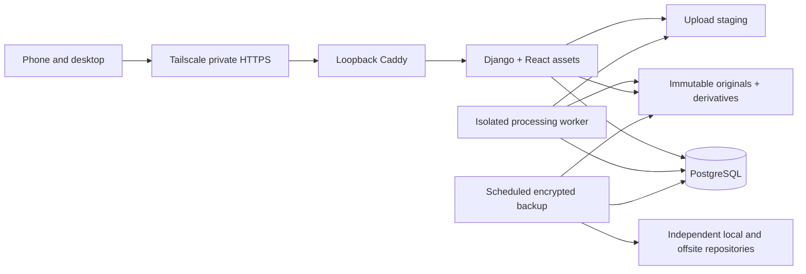

# Architecture recommendation

Use **React + TypeScript + Vite**, **Django 5.2 LTS**, **PostgreSQL 17**, **Pillow + pillow-heif in a separate processing worker**, **Caddy**, **Docker Compose**, and **Restic for encrypted backups**. For two people, default to **Tailscale Serve** for private HTTPS access. Django serves the built React assets and same-origin API; there is no separate Node runtime in production.

Django is preferable here to a custom FastAPI/Next.js authentication layer because it provides maintained session authentication, CSRF protection, migrations, account administration, and password validators. React provides the interactive scrapbook without requiring server rendering or SEO for a private app. PostgreSQL supports constraints, indexing, text search, and a small durable job queue. A PostgreSQL-backed worker avoids operating Redis for a two-person library. Pillow provides a maintained image decoder and EXIF support; HEIC needs explicit pillow-heif support and fixtures before accepting iPhone originals.

This trades a two-language codebase for fewer custom security components. Ten thousand photos is a modest database workload; storage size, image decoding, backup throughput, and browser memory are the practical constraints. Begin with a supported Linux host, 2–4 CPU cores and 4 GB RAM, SSD storage sized for originals plus derivatives and headroom, and an independent backup destination. Benchmark large HEIC images before increasing processing concurrency.

Worker and backup services are planned for later increments. They do not run in the current Compose file.

## Database design

Django models and the first migration are executable schema definitions. Both users share one library. This is intentionally not a multi-tenant product: any active member will be able to read all non-trashed photos, edit captions/dates, and organize shared albums; administrators manage accounts, backups, and destructive operations.

| Table | Main fields / purpose |
|---|---|
| `auth_user` | Django ID, unique username, Argon2 password hash, active/staff flags; supports two or more accounts |
| `django_session` | Opaque session key, server-side session data, expiry; browser receives only the cookie |
| `Photo` | UUID, original filename, opaque original/preview/thumbnail keys, SHA-256, byte size, detected MIME, uploaded_at/by, status, trashed_at |
| Photo dates | taken_at (known instant only), taken_local (camera wall-clock value), offset minutes, display_date, date_source, untouched exif_date_raw |
| Photo metadata | caption, dimensions, original EXIF orientation, camera make/model, latitude/longitude, optional human location label |
| `Album` | UUID, name, description, optional cover FK, creator, creation time |
| `AlbumPhoto` | album FK + photo FK (unique pair), ordering position; one file belongs to many albums |
| `Favorite` | user FK + photo FK (unique pair), created_at; favorites are personal, never a shared boolean |
| `ProcessingJob` | one job per photo, attempts, available_at, lease_until, bounded safe error code |
| `BackupRun` | start/end, running/success/failed, repository snapshot ID, last verification time |

User deletion is protected while uploads/albums refer to them; deactivate accounts instead. Deleting an album removes membership rows, not photos. Deleting a cover clears that reference. Hard photo deletion is not exposed in this increment. Validate that an album cover belongs to its album in the future album service. Coordinate all photo mutations through explicit service functions, including admin actions, rather than letting generic admin edits bypass invariants.

Indexes include the visible-photo `(display_date DESC, id DESC)` partial index, upload time, original checksum, album ordering, and job availability. Unique constraints prevent duplicate memberships/favorites; GPS and orientation ranges have database checks. Foreign keys have indexes. Later search work should add PostgreSQL full-text or trigram indexes for captions/location labels, based on actual query plans. Filter a year/month/day using half-open date ranges, not SQL functions wrapped around the indexed column. Use keyset pagination (date + UUID) with 48 results per request, never return the entire library to React.

## Dates are more than a timestamp

Prefer EXIF DateTimeOriginal + SubSecTimeOriginal + OffsetTimeOriginal; next consider credible digitized/capture metadata. Keep raw metadata for audit and reprocessing. Preserve wall-clock local date when an offset is absent; do not pretend the camera's local time is UTC. If an offset is known, also store its UTC instant in taken_at. `display_date` is the stable calendar date used for organization.

A mobile/web file picker normally provides `lastModified`, not trustworthy original creation time. Copying, messaging, or exporting can change it. Do not use server filesystem ctime as date taken. A future trusted server importer can label a file-date fallback as `file`; browser uploads without usable metadata use server upload time in the library's chosen timezone and are labeled `upload`. Choose a library timezone before ingestion is implemented. Manual edits set date_source=manual and preserve original EXIF data. Changing a date never moves or rewrites the original image.

## Photo upload and processing design (next increment)

1. The mobile `input type=file` supports multiple files without `capture`, so the photo library remains available. Desktop adds drag-and-drop. Send one file per request, with a small upload concurrency of two, progress/error status, and retry identity. Do not make one gigantic multipart request for the entire library.
2. Authenticate and check CSRF before accepting uploads. Stream to a quota-limited staging volume. Enforce 50 MiB per photo, bounded header/body size, request/concurrency limits, and a 100-megapixel decoded image limit at the proxy and application. The current proxy accepts only 64 KiB because uploads are not yet implemented.
3. Assign an opaque UUID path. Ignore any client filename as a filesystem path; retain only a sanitized display filename. Compute SHA-256 while streaming. Detect actual format and decode in the worker; MIME/extension assertions from the browser are not trusted. Accept JPEG/PNG/WebP/HEIC only once tested. Reject SVG, archives, executables, unsupported animation, malformed files, and decompression bombs.
4. Commit a pending Photo and ProcessingJob transaction only after the staged bytes are durable. The queue uses `SELECT ... FOR UPDATE SKIP LOCKED`, bounded attempts, a lease with recovery, and idempotent processing. Interrupted uploads and orphan files need periodic reconciliation and expiry. Return a durable processing status, not a false upload-complete message.
5. In a non-root, resource-limited worker without network access, decode and extract dates, dimensions, orientation, camera, and GPS. Isolate decoders from web request workers. Handle corrupt metadata without silently changing chronology; show the fallback source.
6. Preserve uploaded original bytes exactly. Move them atomically into `/photos/originals/<uuid-prefix>/<uuid>.<detected-extension>`. Store derived `/photos/thumbnails/...webp` (roughly 400 px) and `/photos/previews/...webp` (roughly 2048 px). Apply orientation and color-profile conversion to derivatives, strip EXIF/GPS from derivatives, and never overwrite originals. Finish each derivative by atomic rename, then mark the record ready in a transaction. Keep a recipe/version so derivatives can be regenerated later.
7. If a checksum matches, offer an existing-photo result or safe idempotent reuse after checking the complete operation; do not rely on original filenames for deduplication. A photo in many albums always references the same Photo.
8. Serve bytes only through an authenticated endpoint. Check account status and trash visibility on every request; UUID secrecy is not authorization. Original download is an explicit attachment action. No Caddy file-server route to `/photos`. Use bounded streaming and eventually authorized internal delivery if profiling warrants it.

The derivative cache policy starts `private, no-store` to prevent images resurfacing after logout on shared phones. For performance, lazy-load thumbnails, use smaller responsive derivatives, preload only adjacent picture-book pages, and use in-memory decoded-image reuse. If later enabling persistent browser caching, document the privacy tradeoff; never use public CDN caches or a service worker photo cache by default. ETags/conditional requests can be considered with reauthentication on every request.

## Experience and future extension points

Shared tabs: All memories, Timeline, Albums, Picture book; personal tab: Favorites. A year/month/day picker filters the same paginated query. A photo detail dialog edits caption/date, lists memberships, and optionally shows camera/GPS. Location labels stay local unless both people explicitly choose an external geocoder.

Picture book pages use stable date order or album order, one to three images per spread, captions and quiet dates, keyboard arrows, swipe with a movement threshold, accessible buttons, full-screen where supported, and reduced-motion alternatives. Keep only adjacent pages loaded. On mobile use single-page spreads and preserve normal vertical scrolling.

Add a PWA manifest and locally stored icons later; installation support varies by browser. Cache the public shell only, never authenticated APIs/photos, and clear private state on logout. Offline private photo storage is a separate design decision.

Future videos need a media-kind field and isolated transcoding jobs. Comments reference Photo/User; on-this-day queries use stable local dates; maps use existing GPS; machine tags/face embeddings live in separate versioned tables and optional workers. Import connectors feed the same ingestion service, and ZIP downloads become bounded asynchronous export jobs. Avoid sending originals to external AI services by default. The schema can evolve through migrations without rebuilding storage.
